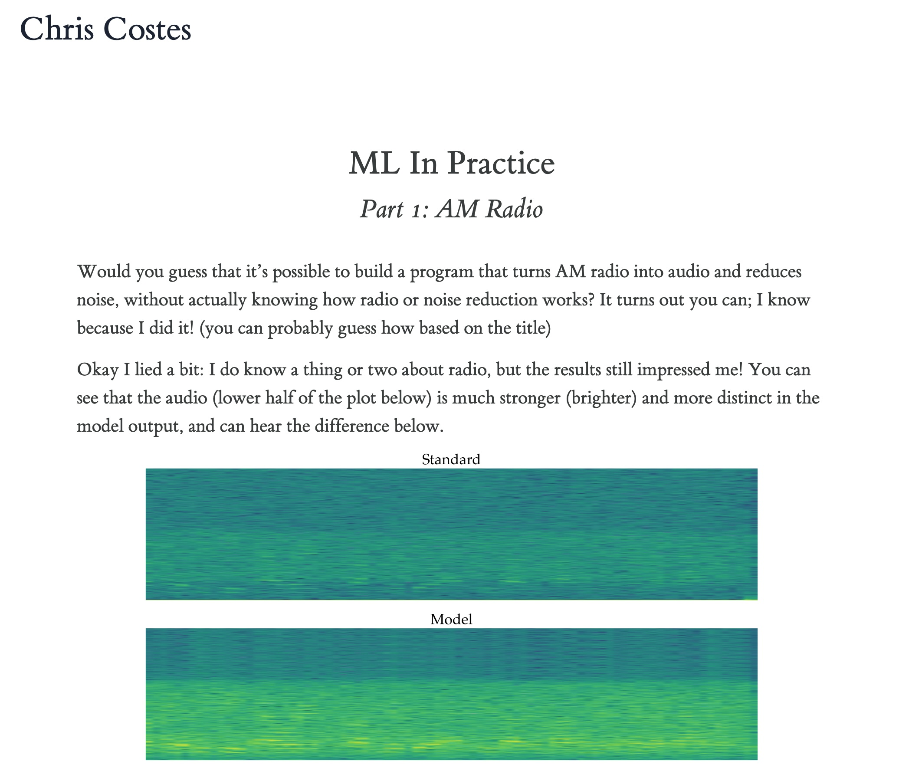

# ML in Practice Part 1: AM Radio

This repo contains the code to generate this **[Blog Post](https://www.ccostes.com/posts/ml/am_explainer)**.
<a href="https://www.ccostes.com/posts/ml/am_explainer"></a>
The Jupyter notebook is stored as a `.py` file using jupytext for better version-control-ability.

## Build
Create a python environment and install the requisite dependencies:
```
python -m venv env
source env/bin/activate
pip install -r requirements.txt
```

### Create `.ipynb` Notebook
If you want to explore and run the code as a notebook, you can generate a traditional python notebook file with `jupytext --to notebook am.py`. If you've created a `.ipynb` notebook and want to updated it from the `.py` file you can use the `--update` flag to prevent overwriting any existing cell outputs.

If you want to update the .py file with changes from the notebook, use `jupytext --to py:percent am.ipynb`

### Generate Markdown
To generate a markdown file for the blog post, run `jupytext --execute --to markdown am.py --output ./index.md` (this will take a min or two).